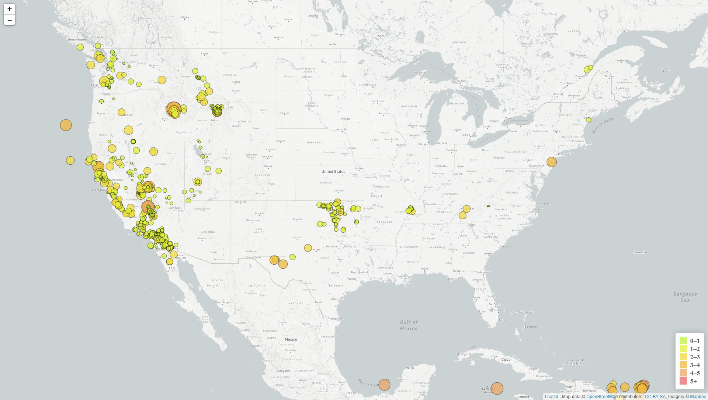

# Visualising Data with Leaflet - Data on earthquake and tectonic plates

## Where is the data from?

* The United States Geological Survey (USGS) provides earthquake data in a number of different formats, updated every 5 minutes. The earthquake data used is 'All Earthquakes from the Past 7 Days' from the [USGS GeoJSON Feed](http://earthquake.usgs.gov/earthquakes/feed/v1.0/geojson.php).

* A second data set on the map is to illustrate the relationship between tectonic plates and seismic activity. Data on tectonic plates can be found at <https://github.com/fraxen/tectonicplates>.

## What did I do?

### Level 1: Visualise an earthquake dataset

Create a map using Leaflet that plots all of the earthquakes from the earthquake data set based on their longitude and latitude.

* The data circle markers reflect the magnitude of the earthquake in their size and color.

* Include popups that provide additional information about the earthquake when a marker is clicked.

* Create a legend that will provide context for the map data.

### Level 2: With data on tetonic plates

* Plot a second data set on the map.

* Add a number of base maps to choose from as well as separate out the two different data sets into overlays that can be turned on and off independently.

* Add layer controls to the map.

- - -

### Copyright of the challenge

Trilogy Education Services © 2019. All Rights Reserved.
